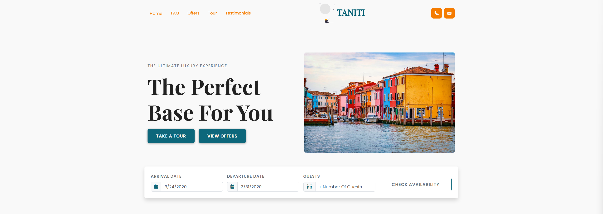

# Taniti Tourism Website

A modern, responsive tourism website for the fictional island of Taniti. Built using Bootstrap 5, this project was designed as part of a UX design assignment to improve the user experience, accessibility, and structure of a tourism-based site.

## Features

• Bright, island-inspired design with ocean blues and accent colors
• Fully responsive layout for desktop and mobile
• Interactive booking form with modal confirmation
• Filterable services section (e.g., Restaurants, Hotels)
• FAQ accordion with themed background
• Special Offers cards with hover effects
• Testimonial carousel
• Embedded tour video section
• Font Awesome icons for rich visuals
• Custom modals and interactive elements using Bootstrap JS

## Usage

This website is built with [Bootstrap 5](https://getbootstrap.com/) and [Font Awesome](https://fontawesome.com/). JavaScript interactivity is handled using Bootstrap’s built-in modal and carousel plugins, plus a custom filtering script.

No installation is required to run — simply open `index.html` in your browser or deploy the files to Netlify, GitHub Pages, or Vercel.

### To Customize

All custom styles are written in plain CSS (split across logical component files like `navbar.css`, `hero.css`, `faq.css`, etc.).

## Credits

• Background images from [Pexels](https://www.pexels.com) and [Unsplash](https://unsplash.com)
• Island data provided by Western Governors University UX Design Project
• Santorini drone video from [Exploropia on YouTube](https://www.youtube.com/watch?v=4zAEDLwl9HI)
